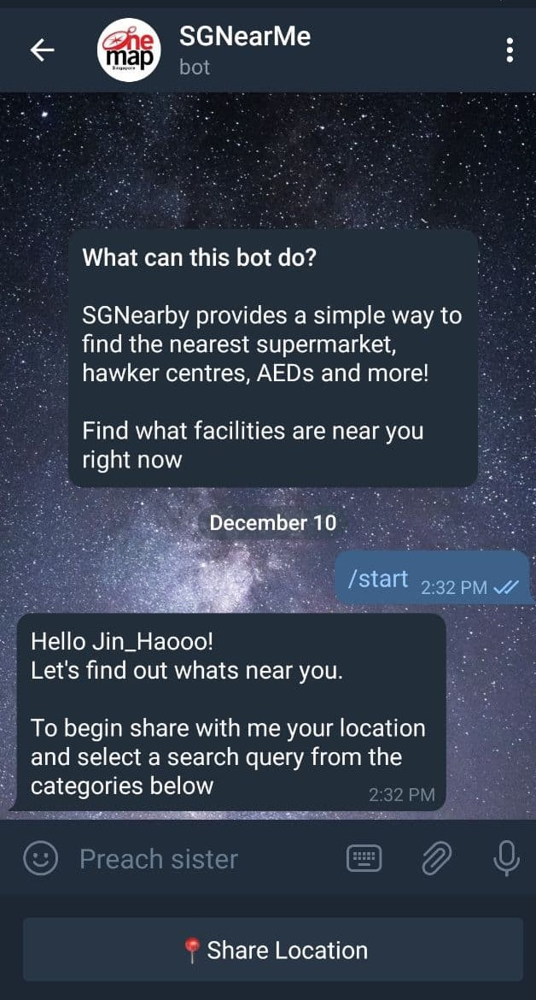
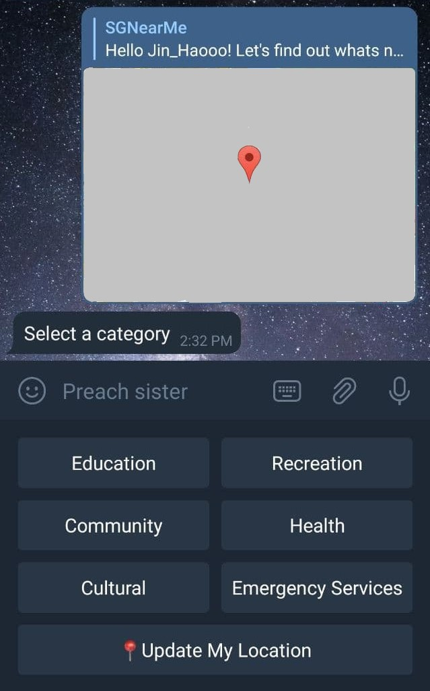
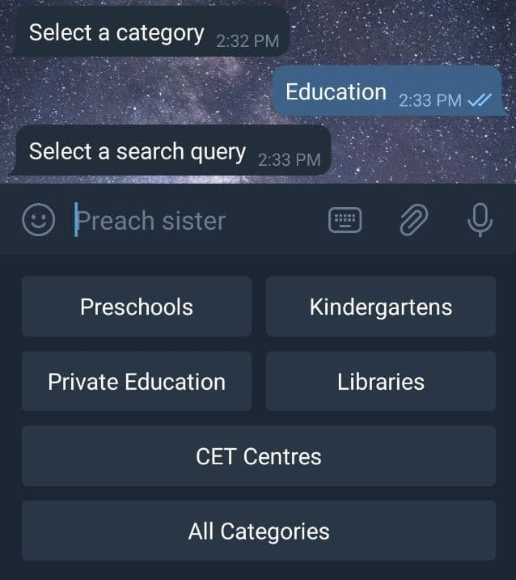
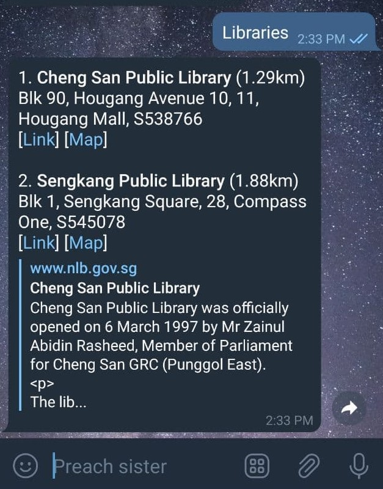

# SGNearMe Telegram Bot
Sometimes you just want to find the nearest supermarket to buy your grocery, or the nearest hawker centre to grab a quick lunch.

SGNearMe Telegram Bot allows you to easily find the 8 nearest places that you are looking for. You can search for the nearest preschools or even the nearest historical sites around you.

The bot is powered by [OneMap](https://www.onemap.sg/home/), a service provided by Singapore Land Authority. The information are contributed and updated by various government agencies

The bot requires location services and can only be used on mobile devices.

### Tools used
- Telegram platform
- [python-telegram-bot](https://github.com/python-telegram-bot/python-telegram-bot) for managing interaction and integration
- [OneMap API](https://docs.onemap.sg/#retrieve-theme) for providing places information and maps

## Usage

1. Starting the bot - `/start` and select `📍Share Location`
  

1. Selecting a category - `/menu` to manually bring up the categories menu
  

1. Selecting a search query
  

1. The nearest 8 related facilities will be shown. (Up to ~2.5km - using a 5km square bounding box)
  

1. Show a OneMap map image (night mode) - `/map`  
    Example map:
    

## Installation
To get a local copy up and running follow these simple example steps.

1. Create a new bot and get the bot API token from [@BotFather](https://t.me/botfather)
  * Follow the instructions [here](https://medium.com/shibinco/create-a-telegram-bot-using-botfather-and-get-the-api-token-900ba00e0f39) for a detailed guide

1. Register for OneMap API [here](https://developers.onemap.sg/signup/)

1. Clone the repo
``` bash
git clone https://github.com/JinHao-L/SGNearMe.git
```

1. Enter your API in `config.py`
``` python
# Telegram bot token from BotFather
BOT_TOKEN = "ENTER YOUR BOT API TOKEN"
```

1. Enter your OneMap login details in `config.py` (for auto-updating of OneMap access token)
``` python
# Login credentials for OneMap
email = "ENTER YOUR ONEMAP LOGIN EMAIL"
password = "ENTER YOUR ONEMAP LOGIN PASSWORD"
```
_Be careful not to push this config file onto a public platform_

1. Start the bot locally by running the python file on the command line
``` bash
python bot.py
```

1. (optional) Update the `DEVELOPER_CHAT_ID` in `bot.py` by obtaining the id using `update.message.chat.id`
  * This is used for sending error message to the developer

### Hosting on Heroku
Read up on [Getting started on Heroku with Python](https://devcenter.heroku.com/articles/getting-started-with-python) or [Deploying Telegram Bot using Heroku](https://towardsdatascience.com/how-to-deploy-a-telegram-bot-using-heroku-for-free-9436f89575d2)

## License
Distributed under the MiT license. See `LICENSE` for more information
